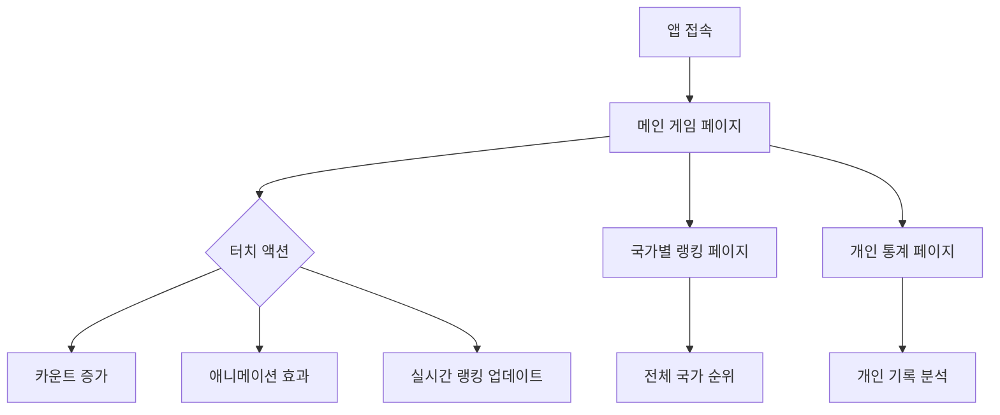

## 1. 제품 개요
Popcat과 유사한 모바일 웹 애플리케이션으로, 사용자가 터치하여 카운터를 증가시키고 전 세계 사용자들과 경쟁하는 간단하면서도 중독성 있는 게임입니다. 
- 문제 해결: 사용자들에게 간단하고 재미있는 시간 killing 게임 제공
- 대상 사용자: 모든 연령대의 모바일 사용자
- 시장 가치: 바이럴 확산 가능성이 높은 간단한 엔터테인먼트 앱

## 2. 핵심 기능

### 2.1 사용자 역할
| 역할 | 등록 방법 | 핵심 권한 |
|------|-----------|-----------|
| 일반 사용자 | 이메일 없이 즉시 사용 | 카운트 증가, 랭킹 조회 |
| 프리미엄 사용자 | 이메일 등록 | 추가 통계, 개인 기록 관리 |

### 2.2 기능 모듈
핵심 페이지:
1. **메인 게임 페이지**: 터치 카운터, 애니메이션, 실시간 랭킹
2. **국가별 랭킹 페이지**: 국가별 순위, 기여도 표시
3. **개인 통계 페이지**: 개인 기록, 업적, 사용 패턴

### 2.3 페이지 상세
| 페이지 이름 | 모듈 이름 | 기능 설명 |
|-----------|-----------|-----------|
| 메인 게임 페이지 | 터치 카운터 | 화면 터치 시 카운트 증가, 터치 애니메이션 표시, 3D 효과 적용 |
| 메인 게임 페이지 | 시각적 피드백 | 고양이 이미지 변경(입 열림/닫힘), 랜덤 효과, 사운드 효과 |
| 메인 게임 페이지 | 실시간 랭킹 | 상위 10개국 실시간 순위 표시, 국가별 총 카운트 |
| 국가별 랭킹 페이지 | 국가 순위 | 전 세계 국가별 총 카운트 순위, 국기 아이콘 표시 |
| 국가별 랭킹 페이지 | 기여도 시각화 | 각 국가의 기여도를 그래프로 표시, 퍼센트로 표현 |
| 개인 통계 페이지 | 개인 기록 | 오늘/이번 주/이번 달 카운트 기록, 최고 기록 표시 |
| 개인 통계 페이지 | 업적 시스템 | 특정 목표 달성 시 업적 부여, 배지 수집 기능 |

## 3. 핵심 프로세스

### 일반 사용자 플로우
1. 앱 접속 → 메인 게임 페이지 로드
2. 화면 터치 → 카운트 증가 + 애니메이션 효과
3. 실시간 랭킹 확인 → 국가별 순위 확인
4. 계속 터치 → 개인 기록 경신
5. 국가별 랭킹 페이지 이동 → 전체 순위 확인

### 프리미엄 사용자 플로우
1. 로그인 → 개인 통계 페이지 접근
2. 개인 기록 분석 → 업적 확인
3. 친구와 경쟁 → 공유 기능 사용

## 4. 사용자 인터페이스 설계

### 4.1 디자인 스타일
- 주요 색상: 밝은 오렌지(#FF6B35), 흰색(#FFFFFF), 연한 회색(#F5F5F5)
- 버튼 스타일: 둥근 모서리, 그림자 효과, 클릭 시 3D 눌림 효과
- 폰트: 둥근고딕 계열, 주요 텍스트 16-24px, 부가 텍스트 12-14px
- 레이아웃: 카드 기반, 중앙 정렬, 반응형 그리드
- 아이콘: 이모지 스타일, 밝고 친근한 느낌

### 4.2 페이지 디자인 개요
| 페이지 이름 | 모듈 이름 | UI 요소 |
|-----------|-----------|----------|
| 메인 게임 페이지 | 터치 영역 | 전체 화면 터치 가능, 중앙에 큰 고양이 이미지, 터치 시 3D 눌림 효과 |
| 메인 게임 페이지 | 카운터 표시 | 상단에 큰 글씨로 현재 카운트, 국가 기여도 작게 표시 |
| 메인 게임 페이지 | 실시간 랭킹 | 하단에 슬라이드 형태로 상위 5개국 표시, 국기 아이콘 포함 |
| 국가별 랭킹 페이지 | 순위 목록 | 카드 형태의 리스트, 국기-국가명-카운트-점유율 표시 |
| 개인 통계 페이지 | 통계 카드 | 그래프와 숫자로 개인 기록 시각화, 업적 배지 그리드 |

### 4.3 반응성
- 모바일 우선 설계: 320px부터 시작하는 반응형 디자인
- 터치 최적화: 최소 터치 영역 44px, 터치 피드백 즉시 제공
- 성능 고려: 3G 환경에서도 3초 이내 로딩, 60fps 애니메이션
- 오프라인 지원: 캐싱을 통한 기본 기능 오프라인 사용