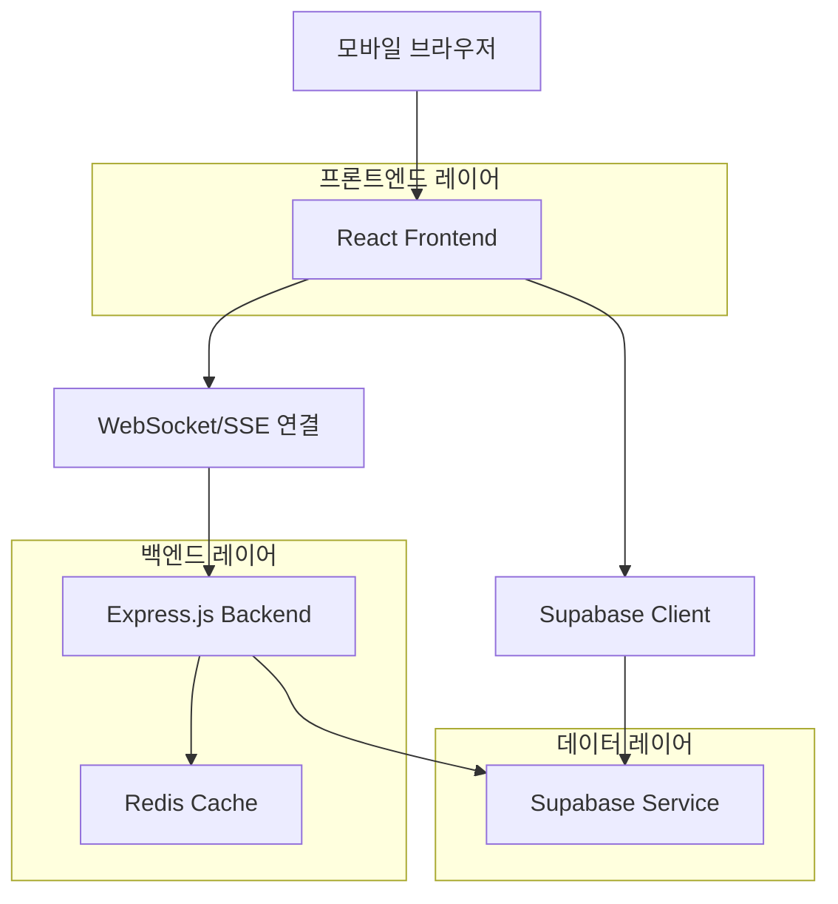
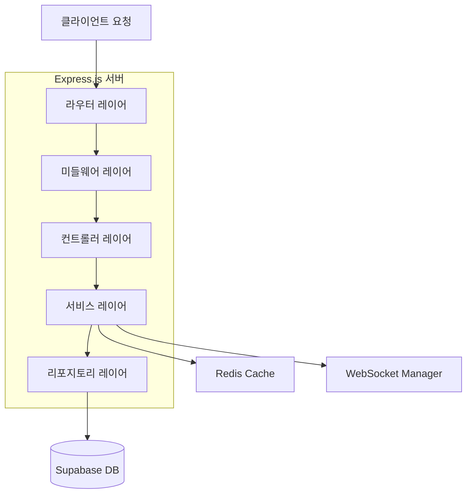
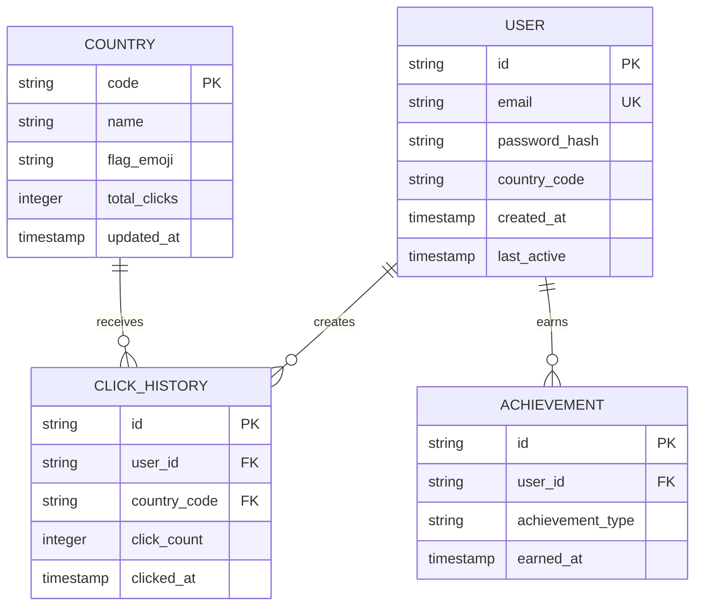

## 1. 아키텍처 설계



## 2. 기술 설명

- 프론트엔드: React@18 + TypeScript + Vite + Tailwind CSS
- 백엔드: Express.js@4 + WebSocket/SSE + Redis
- 데이터베이스: Supabase (PostgreSQL)
- 실시간 통신: Socket.io (WebSocket) 또는 Server-Sent Events
- 상태 관리: Zustand
- 애니메이션: Framer Motion
- PWA: Workbox

## 3. 라우트 정의

| 라우트 | 목적 |
|--------|------|
| / | 메인 게임 페이지, 터치 카운터 인터페이스 |
| /rankings | 국가별 랭킹 페이지 |
| /profile | 개인 통계 페이지 (인증 필요) |
| /login | 로그인 페이지 |
| /register | 회원가입 페이지 |

## 4. API 정의

### 4.1 카운터 API

**카운트 증가**
```
POST /api/counter/increment
```

요청:
| 파라미터 이름 | 파라미터 타입 | 필수 여부 | 설명 |
|--------------|--------------|-----------|------|
| country | string | true | 국가 코드 (ISO 3166-1 alpha-2) |
| userId | string | false | 사용자 ID (인증된 경우) |
| timestamp | number | true | 타임스탬프 |

응답:
| 파라미터 이름 | 파라미터 타입 | 설명 |
|--------------|--------------|------|
| success | boolean | 요청 성공 여부 |
| newCount | number | 새로운 카운트 값 |
| countryRank | number | 국가 내 순위 |

### 4.2 랭킹 API

**국가별 랭킹 조회**
```
GET /api/rankings/countries
```

요청:
| 파라미터 이름 | 파라미터 타입 | 필수 여부 | 설명 |
|--------------|--------------|-----------|------|
| limit | number | false | 조회 개수 (기본값: 50) |
| offset | number | false | 오프셋 (기본값: 0) |

응답:
| 파라미터 이름 | 파라미터 타입 | 설명 |
|--------------|--------------|------|
| rankings | array | 국가별 순위 목록 |
| total | number | 전체 국가 수 |

### 4.3 사용자 API

**개인 통계 조회**
```
GET /api/user/stats
```

요청 헤더:
```
Authorization: Bearer {token}
```

응답:
| 파라미터 이름 | 파라미터 타입 | 설명 |
|--------------|--------------|------|
| totalClicks | number | 총 클릭 수 |
| dailyClicks | number | 오늘 클릭 수 |
| weeklyClicks | number | 이번 주 클릭 수 |
| achievements | array | 획득한 업적 목록 |

## 5. 서버 아키텍처 다이어그램



## 6. 데이터 모델

### 6.1 데이터 모델 정의



### 6.2 데이터 정의 언어

**사용자 테이블 (users)**
```sql
-- 테이블 생성
CREATE TABLE users (
    id UUID PRIMARY KEY DEFAULT gen_random_uuid(),
    email VARCHAR(255) UNIQUE,
    password_hash VARCHAR(255),
    country_code VARCHAR(2) NOT NULL,
    total_clicks INTEGER DEFAULT 0,
    created_at TIMESTAMP WITH TIME ZONE DEFAULT NOW(),
    last_active TIMESTAMP WITH TIME ZONE DEFAULT NOW()
);

-- 인덱스 생성
CREATE INDEX idx_users_country ON users(country_code);
CREATE INDEX idx_users_last_active ON users(last_active DESC);
```

**국가 테이블 (countries)**
```sql
-- 테이블 생성
CREATE TABLE countries (
    code VARCHAR(2) PRIMARY KEY,
    name VARCHAR(100) NOT NULL,
    flag_emoji VARCHAR(10),
    total_clicks BIGINT DEFAULT 0,
    updated_at TIMESTAMP WITH TIME ZONE DEFAULT NOW()
);

-- 초기 데이터 삽입
INSERT INTO countries (code, name, flag_emoji) VALUES
('KR', 'South Korea', '🇰🇷'),
('US', 'United States', '🇺🇸'),
('JP', 'Japan', '🇯🇵'),
('CN', 'China', '🇨🇳'),
('GB', 'United Kingdom', '🇬🇧');
```

**클릭 히스토리 테이블 (click_history)**
```sql
-- 테이블 생성
CREATE TABLE click_history (
    id UUID PRIMARY KEY DEFAULT gen_random_uuid(),
    user_id UUID REFERENCES users(id),
    country_code VARCHAR(2) NOT NULL,
    click_count INTEGER NOT NULL DEFAULT 1,
    clicked_at TIMESTAMP WITH TIME ZONE DEFAULT NOW()
);

-- 인덱스 생성
CREATE INDEX idx_click_history_user ON click_history(user_id);
CREATE INDEX idx_click_history_country ON click_history(country_code);
CREATE INDEX idx_click_history_clicked_at ON click_history(clicked_at DESC);
```

**업적 테이블 (achievements)**
```sql
-- 테이블 생성
CREATE TABLE achievements (
    id UUID PRIMARY KEY DEFAULT gen_random_uuid(),
    user_id UUID REFERENCES users(id),
    achievement_type VARCHAR(50) NOT NULL,
    earned_at TIMESTAMP WITH TIME ZONE DEFAULT NOW(),
    UNIQUE(user_id, achievement_type)
);

CREATE INDEX idx_achievements_user ON achievements(user_id);
```

### 6.3 Supabase 접근 권한

```sql
-- 익명 사용자 읽기 권한
GRANT SELECT ON countries TO anon;
GRANT SELECT ON click_history TO anon;

-- 인증된 사용자 전체 권한
GRANT ALL PRIVILEGES ON users TO authenticated;
GRANT ALL PRIVILEGES ON click_history TO authenticated;
GRANT ALL PRIVILEGES ON achievements TO authenticated;
```

## 7. 성능 최적화 전략

### 7.1 프론트엔드 최적화
- **이미지 최적화**: WebP 형식 사용, 지연 로딩 구현
- **번들 크기 최적화**: 코드 스플리팅, 트리 쉐이킹
- **캐싱 전략**: 서비스 워커를 통한 오프라인 캐싱
- **애니메이션 최적화**: CSS transform 사용, 60fps 유지

### 7.2 백엔드 최적화
- **Redis 캐싱**: 국가별 랭킹 데이터 5분간 캐싱
- **데이터베이스 인덱싱**: 자주 조회하는 컬럼에 인덱스 생성
- **연결 풀링**: 데이터베이스 연결 효율化管理
- **요청 제한**: IP당 분당 1000회로 제한

### 7.3 모바일 최적화
- **터치 이벤트 최적화**: 300ms 지연 제거, 패시브 리스너 사용
- **뷰포트 최적화**: 모바일 장치에 맞춘 메타 태그 설정
- **배터리 사용 최소화**: 애니메이션 중단 옵션, 배터리 상태 감지

## 8. 테스트 전략

### 8.1 유닛 테스트
- **컴포넌트 테스트**: React Testing Library 사용
- **유틸리티 함수**: Jest를 통한 비즈니스 로직 테스트
- **커버리지 목표**: 80% 이상

### 8.2 통합 테스트
- **API 테스트**: Supertest를 통한 엔드포인트 테스트
- **실시간 통신**: WebSocket 이벤트 테스트
- **데이터베이스**: 트랜잭션 테스트

### 8.3 E2E 테스트
- **모바일 시뮬레이션**: Chrome DevTools Protocol 사용
- **터치 이벤트**: Cypress 또는 Playwright로 터치 동작 테스트
- **성능 테스트**: Lighthouse CI를 통한 성능 모니터링

### 8.4 부하 테스트
- **동시 사용자**: 10,000명 동시 접속 테스트
- **카운트 증가**: 초당 1,000회 카운트 증가 테스트
- **3G 환경**: 네트워크 제약条件下的 성능 테스트